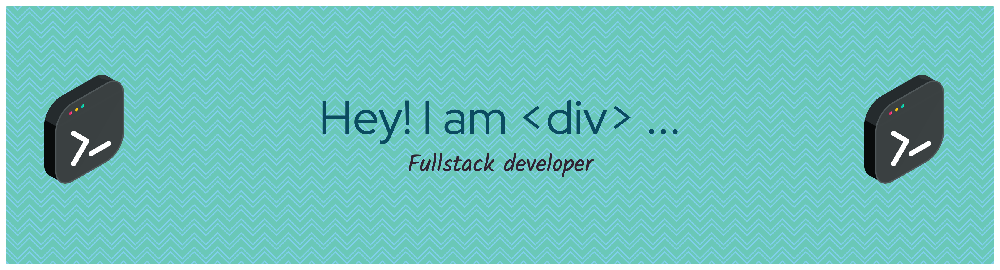
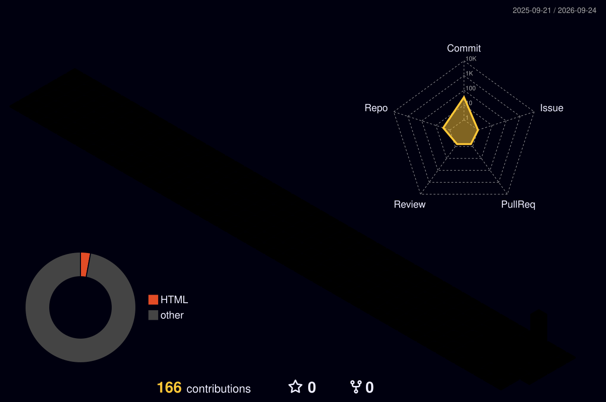

<!-- Terminal-style header banner -->

<!-- Animated header -->
<p align="center">
  
</p>


<!-- Typing animation -->
<p align="center">
  <a href="https://git.io/typing-svg">
    
  </a>
</p>


<!-- Socials -->
<p align="center">
  <a href="https://www.linkedin.com/in/dsdivyanshsh2109/"></a>
  <a href="mailto:dsdivyanshsh@gmail.com"></a>
  
</p>

---

### 🧑‍💻 About Me

```javascript
const divyansh = {
  role: "Web Developer",
  funFact: "my name literally starts with <div> — it was destiny",
  currentlyBuilding: "cool things for the web",
  currentlyLearning: ["TypeScript", "Backend architecture"],
  askMeAbout: ["web dev", "JavaScript", "React"],
  reachMe: "dsdivyanshsh@gmail.com",
};
```

---

### 🛠️ Tech Stack

<p align="center">
  
</p>

---

### 🌆 My Contributions in 3D

An animated, isometric 3D city built from my actual contribution graph — regenerated automatically every day.

<p align="center">
  
</p>

---

### 📊 GitHub Stats


<p align="center">
  <a href="https://git.io/streak-stats">    </a>

  
</p>
<!-- Typing animation -->
<p align="center">
  <a href="https://git.io/typing-svg">
    
  </a>
</p>
---

### 🐍 Contribution Snake

<p align="center">
  
</p>

---

### 🎮 Debug Dash — a game I built

Bugs sneak into live code lines, and you have to click-squash them before they ship to production. Combo multipliers, ramping difficulty, and typos like `lenght` and `retrun` waiting to be squashed.

<p align="center">
  <a href="https://thedivtag.github.io/debug-dash/"></a>
</p>

---

<p align="center">
  
</p>
